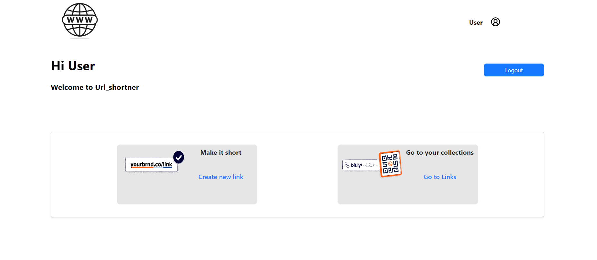

# URL_Shortner

## Readme

This is the repository for URL_Shortner application.

## Tech stack

1. React JS with javascript (front-end)
2. Node JS with Express Js and javascript (back-end)

## Dependency versions:

1. Node JS - v18.16.0
2. npm - 9.7.2
3. React version - 18.2.0

## Development tools and docs

1. Code editor: Visual Studio Code
2. VS code extensions:
   - Prettier

## Libraries used:

1. Ant Designs - For UI development.
2. Jsonwebtokens - For Authentication

## Database used:

1. postgreSQL --version 16

## Commands for developers

1. Start the React JS server: `npm run dev`
2. Start the Backend server : `npm start`

## Development setup

1. Do `npm install` inside `Backend` directory and npm install inside `Web_client` directory seperatly.
2. Need to setup .env file for both backend and Web_client, you can refer `.env-example` file (you can just copy and rename the same file to`.env`, the project will run).
3. Run dev react server with the command mentioned in the package.json file.(`npm start`)
4. Run dev Node server with the command mentioned in the package.json file.(`npm run dev`)

## Testing

- Backend unit testing is done by `.rest`
- Front-end tesing is done manually

## Screenshots of UI

### Login page

This is the user interface which user can Login to the system

### Register page

This the UI for user to register as a new user

### Dashboard page

This is the user interface were the user can reach after login and from here the user can create new url or got to view previous urls

### Url-creating page

Here user can add the Long url and add a custonm url name if needed (optional)

### Output page

Here user can get the short url and its details when user hits the create butoon on the url-creating page

### Previous-links page

Here user can view all the previous links in which he has created
